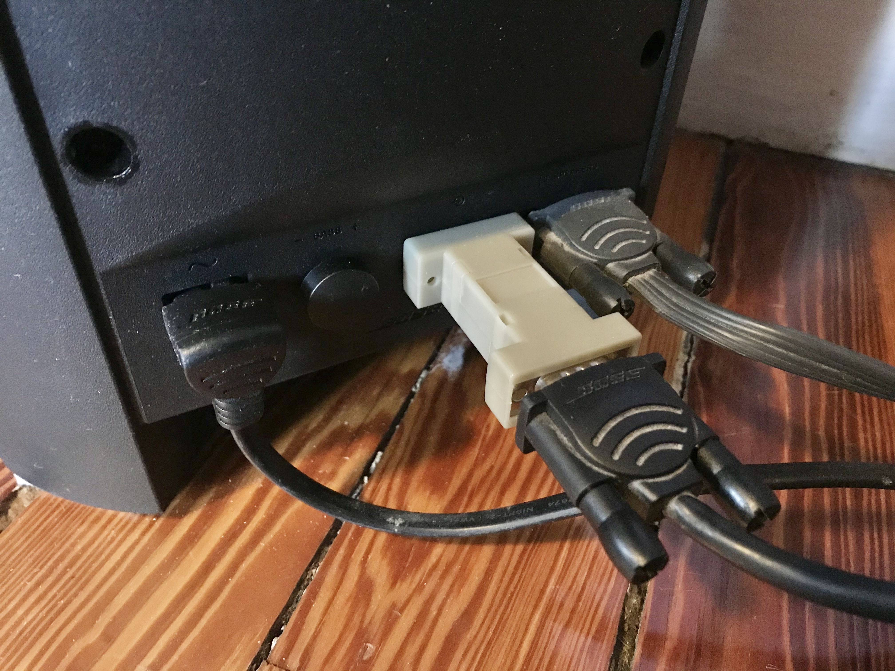
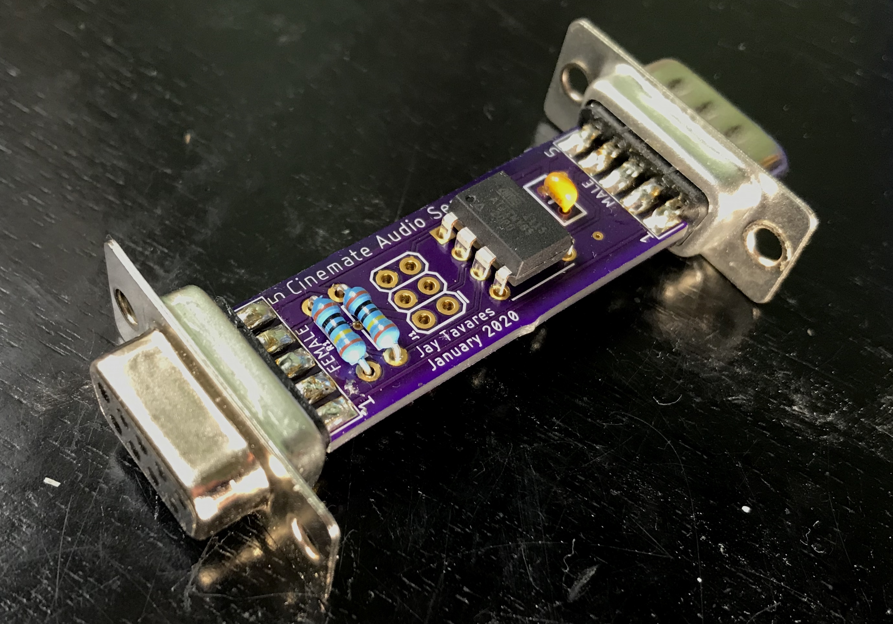

# Cinesense: an Audio Sensing Add-on for Bose Cinemate Speakers


Do you have Bose Cinemate speakers? Do you wish they would just turn on automatically when you need them
and turn off when you're done. This project provides everything you need to do just that. Using it, you can create an
adapter that plugs into the interface module cable and adds audio sensing capability to your Bose Cinemate speakers.*

\* This project has only been tested with Bose Cinemate GS Series II speakers. I _think_ it should work with other
related models, but YMMV.

## The Parts List
You'll need a few parts:

- 1x [Dual sided hood](https://www.showmecables.com/db9-hd15-vga-dual-sided-hood-plastic)
- 1x [DB9 Male connector](https://www.showmecables.com/db9-male-solder-connector)
- 1x [DB9 Female connector](https://www.showmecables.com/db9-female-solder-connector)
- 1x [ATTINY85 microchip](https://www.digikey.com/product-detail/en/microchip-technology/ATTINY85-20PU/ATTINY85-20PU-ND/735469)
- 2x [1㏁ resistors](https://www.digikey.com/product-detail/en/stackpole-electronics-inc/CF14JT1M00/CF14JT1M00CT-ND/1830423)*
- 1x [.1µF capacitor](https://www.digikey.com/product-detail/en/kemet/C320C104M5U5TA7301/399-9872-1-ND/3726097)
- 1x [2x3 header](https://www.digikey.com/product-detail/en/adam-tech/PH2-06-UA/2057-PH2-06-UA-ND/9830396) (_Optional_--only needed if you plan to program the chip on the board.)

\* Linked resistor should work, though I just used some spares I had on hand of unknown brand.

## The Tools
Naturally, you'll need soldering supplies to assemble the board. Once assembled, I use the [Pocket AVR Programmer](https://www.sparkfun.com/products/9825)
from SparkFun to program the chip.
 
## The Circuit Board



### Quick & Easy
For convenience, You can purchase the board on [OSHPark](https://oshpark.com/shared_projects/EzLrNW1y).

### Schematic and Board layout file
The board was designed using Eagle. If you need to make any modifications, you will find the original CAD files in the [board](./board) folder.

## The Software

### Use Precompiled software (Easiest option)
 1. Download the most recent `.hex` file from the [Releases](https://github.com/jaytavares/cinesense/releases) page.
 2. Connect your AVR Programmer to the chip. (I've included an ISP header on the board if you don't have a standalone programmer for ATTINY chips.)
 3. Use [avrdude](http://savannah.nongnu.org/projects/avrdude/) to program the ATTINY chip. Assuming you're using the "Pocket AVR Programer", run:
```
$ avrdude -c usbtiny -p t85 -U lfuse:w:0xe2:m -U hfuse:w:0xdf:m -U efuse:w:0xff:m -U flash:w:firmware.hex:i
```

### Build from the source (Most flexible option)
If you would like to customize your Cinesense, you'll have to build the software from the source. The software for this project is built using the fantastic [PlatformIO](https://platformio.org). 

#### Programming the chip
 1. Connect your AVR Programmer to the chip. (I've included an ISP header on the board if you don't have a standalone programmer for ATTINY chips.)
 2. In the root directory of this project, run:
```
platformio run
```
This should compile the software, burn the correct fuses, and upload the software to the chip.

## Legal
This project is licensed under the MIT License. See [LICENSE.txt](LICENSE.txt) for more information. "Bose" and "Cinemate" are registered trademarks of Bose Corporation, Framingham, MA. This project is not endorsed or affiliated with the Bose Corporation.
